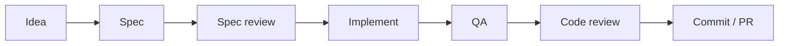

# Recommended Workflow

How the AppVerk marketplace plugins compose into one development harness —
the lifecycle of a feature from idea to merged PR. Each stage produces an
artifact the next stage consumes; nothing is handed over by memory.

## Prerequisites

- This marketplace installed: `/plugin marketplace add AppVerk/av-marketplace`
- **Strongly recommended:** the `superpowers` plugin from the official
  Claude Code plugin marketplace — it drives Stages 1–2 (brainstorming a
  spec) and provides the plan-first implementation flow in Stage 3. Without
  it the cycle degrades gracefully: start at Stage 3; Stages 1–2 are
  skipped.

See [Installation & Optional Tools](installation.md) for the optional
scanners and linters the plugins auto-detect.

## The cycle



### Stage 1 — Idea → Spec *(superpowers, strongly recommended)*

**Purpose:** turn an idea into an agreed design before any code exists.

Ask Claude to brainstorm the feature; the superpowers brainstorming skill
asks clarifying questions, proposes approaches, and writes the agreed
design to a spec file.

**Artifact:** `docs/superpowers/specs/YYYY-MM-DD-<topic>-design.md`
**Next stage consumes:** the spec file — spec-review reads it directly.

### Stage 2 — Spec review *(superutils)*

**Purpose:** catch contradictions, ambiguity, and gaps while they are
still cheap to fix.

```
/superutils:spec-review
```

Runs a closed review loop on the newest spec (lens panel → adversarial
challengers → approve-gated fix batches) until it converges or stops.

**Artifact:** report and state sidecar in
`docs/superpowers/specs/reviews/`; terminal status `CONVERGED` or
`STOPPED(...)` — a stop is never success.
**Next stage consumes:** the reviewed spec, now the contract for the plan.

### Stage 3 — Plan & implement

**Purpose:** build the feature test-first against the reviewed spec.

```
/develop <task>
```

The stack-specific `/develop` command (frontend-developer, php-developer,
python-developer) is the recommended path when a matching developer plugin
is installed — it enforces coding standards and TDD for its stack. For
stacks without one, or for a plan-first language-agnostic flow, use the
superpowers writing-plans / TDD skills instead.

**Artifact:** implemented, tested code on the feature branch.
**Next stage consumes:** the branch diff — QA generates its test plan
from it.

### Stage 4 — QA *(qa)*

**Purpose:** verify the change end-to-end (frontend and backend) before
review.

```
/qa:loop
```

`/qa:loop` is the recommended first choice: it generates a test plan for
the branch when none exists, runs it, fixes failures, and re-tests until
green or budget exhausted. Prefer the manual pair `/qa:create-plan` →
`/qa:run` when you want to inspect or edit the plan before execution.

**Artifact:** test plans in `docs/testing/plans/`, reports with `QA-XXX`
issue IDs in `docs/testing/reports/`.
**Next stage consumes:** the QA report — code-review's fix commands
operate on its issue IDs.

### Stage 5 — Code review *(code-review)*

**Purpose:** security, performance, architecture, and maintainability
analysis with addressable findings.

```
/review
```

The report assigns each issue a unique ID (`SEC-XXX`, `PERF-XXX`,
`ARCH-XXX`, `MAINT-XXX`, `DOC-XXX`). Fix a single issue with `/fix <ID>`,
work through reports as a checklist with `/fix-report` (auto-merges
review and QA reports), or fix everything except `needs-decision` issues
with `/fix-all`.

**Artifact:** review report in `docs/reviews/`.
**Next stage consumes:** a clean working tree — every accepted fix
applied.

### Stage 6 — Commit & PR *(commit)*

**Purpose:** ship the change with a clean history and guarded pushes.

```
/commit
```

Generates a Conventional Commits message; push guards protect
`master`/`main`, tags, and non-origin remotes. After opening the PR,
handle reviewer feedback with the code-review plugin's
`/analyze-feedback`.

**Artifact:** commits and a PR; feedback analysis persisted by
`/analyze-feedback`.

## Cheat sheet

| Stage | Plugin | Command | Artifact |
|---|---|---|---|
| 1. Idea → Spec | superpowers *(external)* | brainstorm with Claude | `docs/superpowers/specs/*.md` |
| 2. Spec review | superutils | `/superutils:spec-review` | `docs/superpowers/specs/reviews/*` |
| 3. Plan & implement | frontend/php/python-developer (or superpowers) | `/develop <task>` | code on the branch |
| 4. QA | qa | `/qa:loop` | `docs/testing/plans/*`, `docs/testing/reports/*` |
| 5. Code review | code-review | `/review`, then `/fix` · `/fix-report` · `/fix-all` | `docs/reviews/*` |
| 6. Commit & PR | commit | `/commit` | commits, PR |

## Outside the cycle

- **web-auditor** — `/audit <url>`: passive web audit (security, SEO,
  performance, compliance) of a running site; independent of the feature
  cycle.
- **security-pipeline** — `/setup`: one-time generation of CI/CD security
  scanning steps (Semgrep + TruffleHog) for your pipeline.
- **sequentialthinking** — MCP server used by other plugins (e.g.
  superutils decomposition); no commands of its own.

Flags, options, and edge cases for every command live in the per-plugin
guides: [Plugin Guides](plugins/).
